<div align="center">

# ⚔️ Meridian

**An infinite, procedurally generated medieval world that runs entirely in your browser.**

Mountains, rivers, deserts, and jungles as far as you can walk. Towns full of people with names, homes, jobs, and opinions about you. Ruins with stories, wizards on hilltops, skirmishes on the road. And villagers who talk back through a small language model and a neural voice, both running locally on your own GPU.

**[▶ Play in your browser](https://kuczmama.github.io/meridian/)**

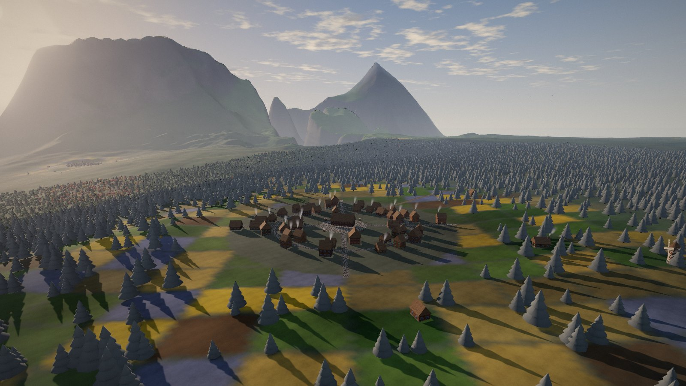

| | |
|---|---|
| 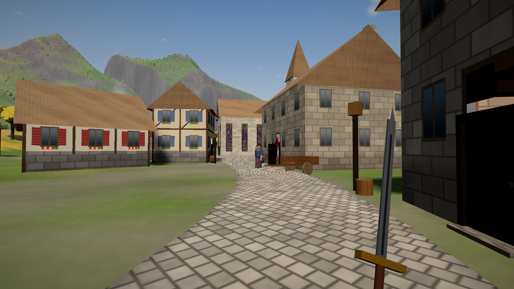 | 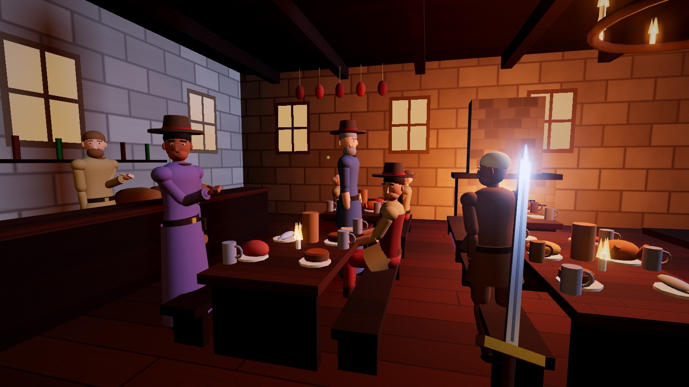 |
| 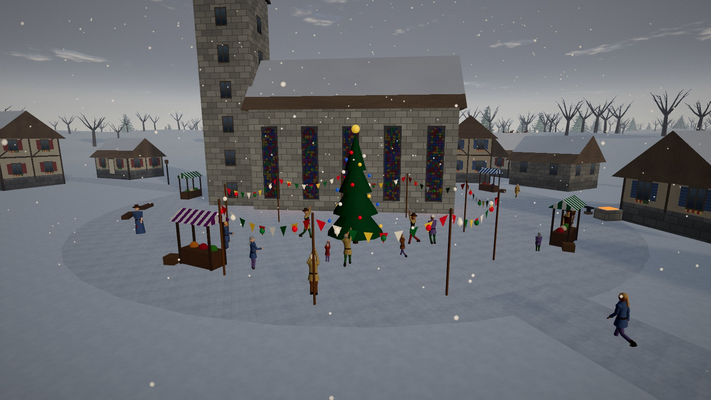 | 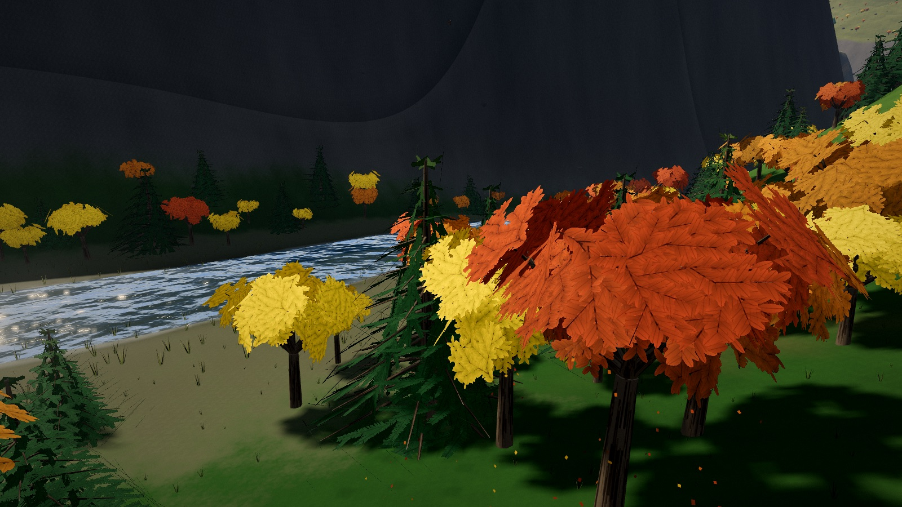 |

</div>

---

## What's in the world

### 🌍 An endless planet
- A seeded, infinite world with continents, oceans, lakes, and rivers. Terrain is shaped by ridged and eroded noise, and each region gets a climate and biome: tundra, taiga, temperate forest, grassland, savanna, desert, badlands, and rainforest.
- Terrain streams in levels of detail around you on a pool of background workers. Forests, rocks, and grass are placed per biome, and every tree trunk and boulder is solid.
- A dynamic sky with a day/night cycle, drifting cloud shadows, aerial perspective, bloom, and ambient occlusion.

### 🏘️ Living towns
- Hamlets, villages, towns, and cities in four cultures: temperate, northern, desert, and tropical. Each has its own architecture, landmark hall (chapel, longhall, domed hall, or great house), market, inn, and streets.
- **Towns are where they are for a reason.** Every settlement is near water: a river, a lake or the sea. Harbours and rivers make towns grow, and only a place with a harbour or a river becomes a city. Dry country holds only temporary camps of tents round a fire, unless there's ore in the hills to mine.
- **Three ways of building.**
  - *Medieval* towns have half-timbered houses with jettied upper floors, and dense old-town rows three and four storeys high along cobbled lanes.
  - *Mediterranean* towns on the warm coasts are pastel stucco weathering down to the stone. They have terracotta hip roofs, shutters and geraniums, iron balconies, roof terraces under pergolas, washing strung across the lanes, a marble church with a brick campanile (and a dome in a big town), a tiered fountain and cypresses. In the dry south they're whitewashed with blue domes.
  - *Eastern* towns cover whole regions. They have dark-timber machiya with paper-screen windows under curved kawara roofs, a temple hall and a five-roofed pagoda, torii gates, stone lanterns, rock gardens of raked gravel, sakura, koi ponds, teahouses and shrines. The people have eastern names and dress.

| | |
|---|---|
| 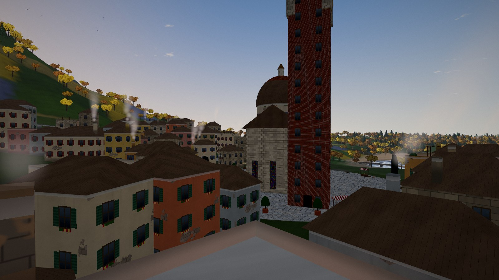 | 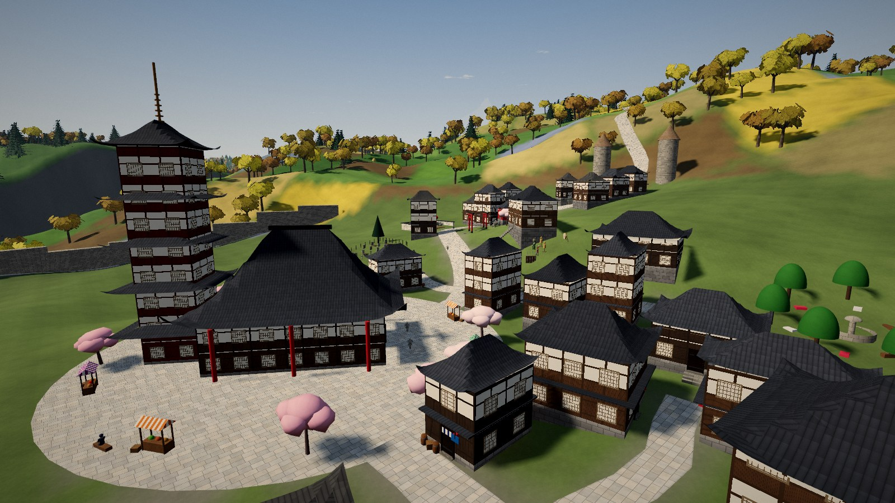 |

- **Towns build with what the land gives them:** stone and slate in the hills, timber and wooden shingle in the forests, brick and tile on the clay. A castle is stone where there's stone to quarry and a timber palisade fort where there isn't. Harbour towns keep a fleet of boats at the jetty.
- **Castles.** An octagonal curtain wall with arrow slits and battlements. Drum towers with conical roofs or crenellated tops, and the lord's banners. A gatehouse with a raised portcullis, a moat and a lowered drawbridge. Round a flagged bailey stand the keep with its corner turrets, the great hall, barracks, an armoury, a chapel, a well, and a training yard of straw men and archery butts.
- **The court.** In the great hall a king and queen (or a lord and lady) hold court on their thrones under a cloth of estate, morning and afternoon. The hall has black-and-white marble, a red carpet to the dais, feasting tables, a great fireplace, banners between the stained-glass windows, and open roof timbers. They sleep in the keep, in a canopied bed of state under a stone gallery. Knights and soldiers drill in the yard, sleep in bunks in the barracks, and guard the gates.

| | |
|---|---|
| 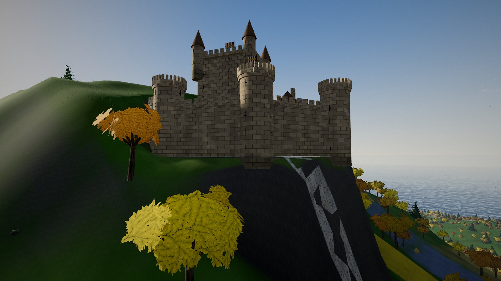 | 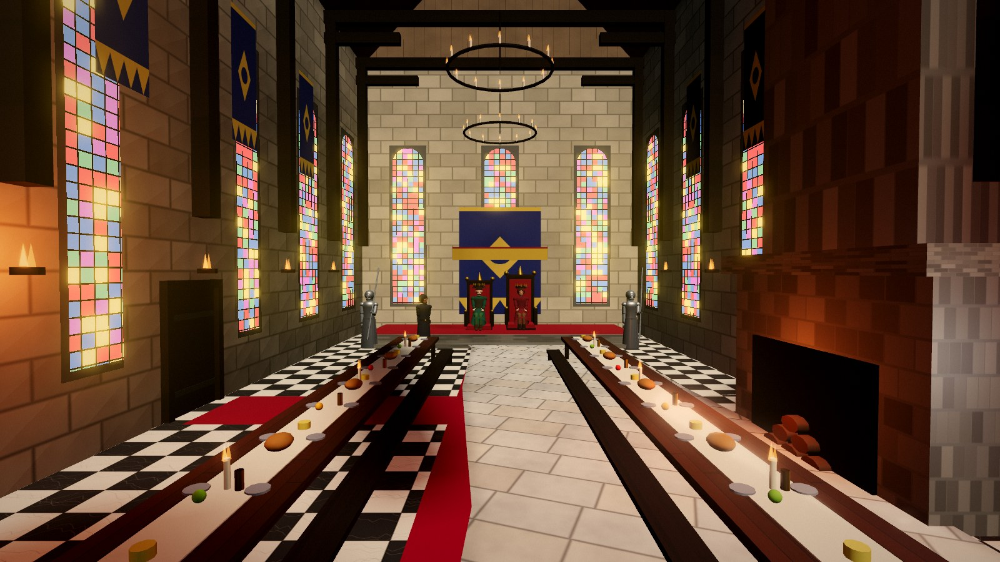 |

- **Great cities.** Here and there, on the best harbour or river of a region, stands a great city of 1,000 to 2,400 people, some 800 metres across, with nothing else within a couple of kilometres but its own farms.
  - *Its streets:* twelve avenues radiate from a cathedral-sized church (or temple, or domed hall), two ring boulevards circle the old town and the new, and hundreds of alleys fill the blocks between.
  - *Its buildings:* over a thousand in all. There's a palace-castle on the high ground, flagstone piazzas with their own fountains and markets, noble mansions with walled gardens, guild halls, a college with a two-storey library, an open-air theatre with players on the stage, an arena, markets, bathhouses, dozens of eating houses and inns, and a hundred-odd craftsmen's shops.
  - *Its people:* every resident is a real person with a home, a trade and a day: porters, clerks, labourers, hawkers, sailors, scholars, guildmasters, nobles and their servants. Only those near you are drawn, so a city of two thousand runs as smoothly as a village.

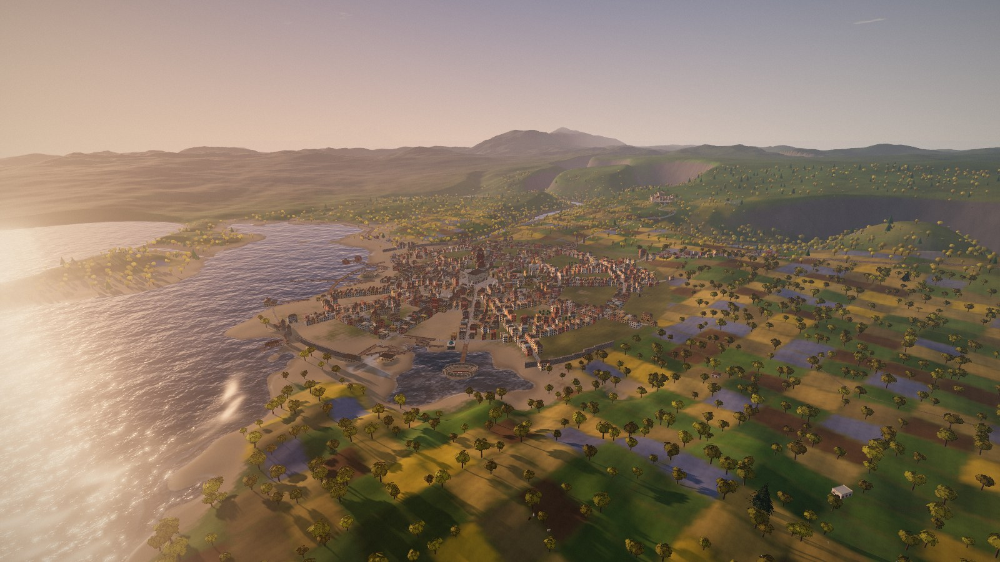

| | |
|---|---|
| 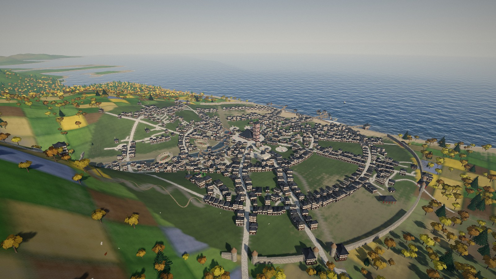 | 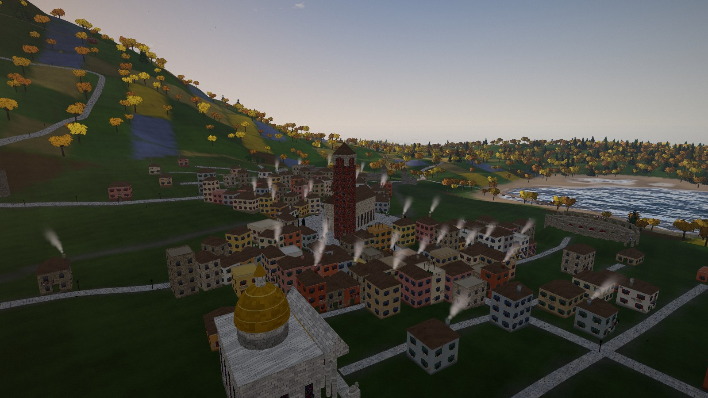 |

- **Cities are cities.** A dense centre of shops, a covered market, eating houses, a gaming house, public baths and latrines, an arena with a tilt barrier, and a museum. The grandest museums have a portico and a gilded dome over a rotunda where a dragon's skeleton hangs, with a plaque on every exhibit. Suburbs spread out along the roads past the walls, and royal roads, wide and cobbled, join the big towns.
- **Casinos you can play in.** Every great city, most other cities and the richer seaside resorts have a casino: a colonnaded palace with a gilded cupola (a lacquered House of Fortune in the east, Il Ridotto by the Mediterranean, a domed Palace of Chance in the desert). Inside, under a painted ceiling and chandeliers, croupiers run the tables from noon until four in the morning and townsfolk while away their evenings. Walk up to a table and play for real gold: **roulette**, **blackjack**, **baccarat**, **hazard** (chō-han in the east), **draw poker** and **the great wheel**. The little gaming houses deal cards and dice too, for smaller stakes.
- **Every town has its institutions.** A hospital with physicians, nurses and patients in their cots. A brewery (sake in the east) with coppers and a mash tun. A garrison, and craftsmen's shops: an apothecary, a tailor, a cobbler, a chandler, a jeweller, a weaponsmith, and dozens more across the styles, each with its own wares on the shelves and a craftsman behind the counter. There are storehouses, granaries and harbour warehouses too.
- **Trades by the land.** Watermills on the rivers. Gold-rush towns where prospectors pan the river below the sluices and sell their dust at the assay office: buy a pan and try it yourself. Smelters by the mines, lumberyards at the edge of forest towns, and shipyards where hulls stand on the slipways in their ribs, with a treadwheel crane over them.
- **Every home is its own.** Each household gets a floor plan of its own: a hall or parlour, a kitchen, a dining room, a pantry, a workshop or a study downstairs; bedrooms, a children's room, a washroom with a tub and a solar upstairs, up to three storeys joined by a real staircase. Rooms have doors (some left open), and the townsfolk walk through them and up the stairs to their own beds.
  - *Who lives there shows.* How well off they are decides the floors (beaten earth and straw, worn planks, parquet, marble), the walls (peeling limewash, coloured plaster, panelled wainscot, stencilled fleurs-de-lis, damask hangings, bare stone or brick), the beds (a straw pallet or a curtained four-poster), the light (a lantern, an iron ring of candles, a chandelier) and what hangs on the walls: real old-master portraits and landscapes in gilt frames, a devotional icon, a child's cross-stitch sampler, plates on a rack, antlers, shields, tapestries.
  - *How tidy they are shows too:* a laid table with flowers and a turned-down bed, or unmade beds, dirty plates, clothes and boots on the floor, grime and cobwebs. Empty houses stand under dust sheets.
  - *So do their trade and tastes:* a scholar's bookcases and writing desk, a spinning wheel, a chess table, a hunter's trophies, a trade corner with the tools of the job.
  - *And the country:* eastern homes have an earth-floored entry, tatami rooms behind paper screens, a sunken irori hearth, a tokonoma with a hanging scroll and ikebana; Mediterranean homes have terracotta and tiled dadoes and painted furniture; desert homes have divans, kilims, brass trays and a clay oven; northern homes keep their log walls, benches and furs.
  - *Real things in them:* furniture, crockery, food, plants and ornaments are photo-scanned models, the floors and walls are photographed surfaces, the kitchen beams hang with hams, onions and herbs, the hearths burn with real fire, and windows seen from inside are bright with the day, with curtains in the better rooms.
- **Shops sell real wares:** jars, pottery, baskets, brass pots and goblets, carved figures, blades, leather boots, bolts of cloth and rolled carpets on proper shelves, with the walls finished and a lantern overhead.
- **Every inside matches its outside.** Tall, ornate buildings are tall and ornate within; eastern rooms have tatami and paper screens, Mediterranean ones terracotta floors. Floors sit level on hillsides, with stone steps up to the door.
- **Streets furnished for living in.** Lamps down every lane and round the square (iron lamp posts with an arm over the street in the cities, timber posts in the towns, stone lanterns in the east), benches along the main streets, street trees in stone curbs, flowers in pots and half-barrels at the doors, drinking fountains, fountains in little piazzas with benches round them, and wells out along the village lanes. At night the nearest lamps light the walls and faces around them, and every lamp down the street throws its own pool of warm light on the ground.
- **Windows that suit the building.** A cottage has a few small casements set where the walls allow; a tall town house has its tallest windows on the first floor and small ones under the eaves; shops have wide small-paned fronts over a stall-board; halls have tall arched lights (pointed in stone); barns and stores have a few high openings; towers have narrow round-headed lights. Timber houses glaze in leaded diamonds, stone in small panes behind dressed-stone surrounds, stucco in two leaves under a transom, and gable ends have fewer windows than fronts.
- **Doors mean something.** Townsfolk walk round buildings, not through them, and come and go by the doors; frightened people fleeing you, and guards chasing you, steer round walls too, and anyone caught indoors runs out by the door. A locked door must be unlocked: you'll see people fumble for the key on their step at night. Visitors knock, and are let in or turned away.
- **Towns grow from their streets.** Winding main streets follow the lie of the land from the square out to every road; side lanes wander off them, and every lane ends at a house, a graveyard, a park, a cloister, or the castle. Hillside towns keep their slopes, and each house stands on its own ground.
- **Every town lives by a trade**, chosen from the land around it, and is laid out to suit:
  - *fishing towns* along a waterfront promenade either side of the jetty;
  - *seaside resorts* with villas, bathhouses, cabanas, parasols and holidaymakers on the beach;
  - *mining towns* whose street switches back up the hill to a timber headframe and a mine you can walk down into, level after level, to chip gold from the veins;
  - *logging towns* with a long high street out to the sawmill and its log yard;
  - *hunters' camps* where the houses stand in a ring round the lodge;
  - *craft towns and cities* built on a planned avenue with side streets at right angles, full of workshops;
  - *farming villages* with lanes out to the barns; *seminaries* with a cloister and chanting monks; *castle towns* and cities with a keep, a moat and drawbridge, and a lord.
- Towns are close together, a couple of kilometres apart, with hamlets between the cities.
- **Trade:** each town's goods (salt fish, gold and iron ore, timber, furs, cloth, tools, grain) are cheap where they're made and dearer the further you carry them, dearest in the cities. Buy gold ore at the mine for half what the city pays. Carters haul loads between the towns and will tell you the prices.
- There's a home for every household, and the rest of the town is workplaces: a hamlet of a dozen people has half a dozen homes; a city of ninety has well over a hundred buildings, most of them shops, halls and storehouses; a great city of two thousand has more than a thousand.
- Roads link the towns, cobbled near the cities, crossing rivers on timber or stone bridges, with milestones, wayside shrines, rest stops and benches at the best views. Walkers, pilgrims and carters travel them. Dirt tracks lead out to the places worth finding, over plank-and-rope footbridges, and animal trails wind through the woods.
- **Every resident is a real person.** Each town's stated population is exactly the number of people who live there, and every one of them has a name, a job, a home, and a daily routine.
- Households of people living alone, couples, and families. People work their stations (chopping, smithing, selling, farming) and eat lunch at the inn and supper at home. Children go to school, and everyone sleeps in their own beds at night.
- Chapels ring their bells before services, and the congregation walks in to fill the pews while the priest preaches. Latecomers stand at the back or kneel outside.
- Civic buildings: a healer's house, an undertaker, a bakery, and a schoolhouse, alongside the inn, smithy, stables, and shops.
- Every building has a swinging door you can walk through, with no loading screen. Inside you'll find furnished rooms lit by hearths, candles, and daylight from the windows.
- **Homes are lived in.** A nameplate by each door says whose house it is. Inside there's a bed for everyone who lives there, a kitchen and a table laid for the household, and the tools of the owner's trade: the smith's rack, the fisher's nets, the hunter's pelts, the priest's icons. Two-storey houses have stairs you can climb to the bedrooms. People cook, eat together, sweep, chat and sleep in their own beds.
- **Taverns** are big halls with a bar and kegs, long tables laid with roast fowl, fish, cheese and ale, and a band on the stage playing jigs on whistle, lute and drum. The chapel organ plays at services, monks chant in the cloister, and horses whinny in the stables.
- **By the water**, towns have a jetty you can walk out on, fishers fishing off it, gutting tables and drying racks, and a seafood tavern. On days off people stroll the beach and children build sandcastles while the surf rolls in. Reeds grow in the shallows.
- **Inland**, hunters head for the woods at dawn, foragers go out with baskets, and meat and hides hang drying behind the houses.

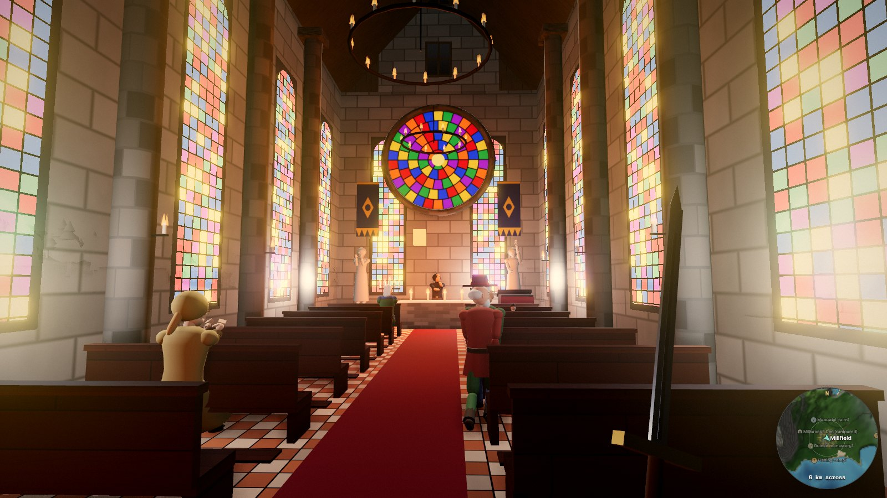

| | |
|---|---|
| 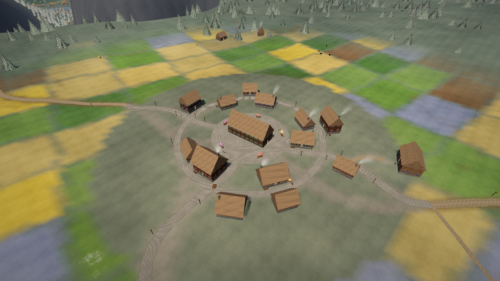 | 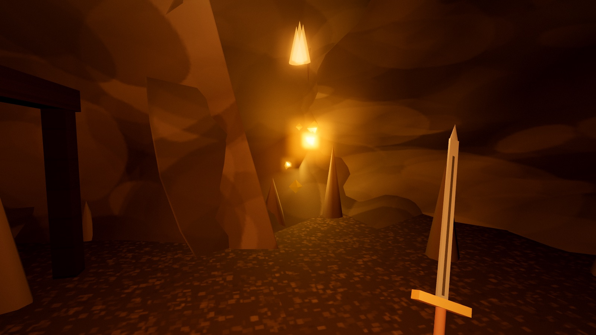 |

### 📅 Days, seasons and weather
- **A real calendar.** Every day has a weekday and a date (the world's year runs 800 years behind ours, so the weekdays line up with today's). The seasons turn: summer days are long and winter suns hang low, more so the further north you go.
- **The week shapes town life.** People sleep at night, eat lunch at noon and work their trades on weekdays, and children go to school Monday to Friday. Friday nights the inn is packed and spills into the street. Saturday is market day with a dance at the fire. Each culture keeps its own holy day: the chapel fills on Sunday, the northern hall holds its moot on Thursday, the desert dome gathers on Friday, and the island great house on Monday. Nobody works on a holy day.
- **Holidays from each culture's own lore.** Christmas Eve with midnight mass and Christmas Day with a tree in the square, New Year, Easter, May Day and its maypole, Midsummer bonfires and All Hallows' Eve in the lowlands. Yule, Midsummer and Winter Nights in the north. The Star New Year and the Night of Falling Stars in the desert. Full-moon gatherings and the Rising of the Seven Stars on the islands. Villagers decorate the square, feast, dance and talk about it.
- **Weather** drifts across the land in fronts shaped by climate and season, mostly fair: clear skies and cloud, morning fog, rain or snow about a sixth of the time, and now and then a thunderstorm or a blizzard. Snow settles on the ground, roofs and roads and melts in the warm. Leaves turn and fall in autumn. People head indoors when it pours.
- The date, the season, the weather and what they are doing all feed into what villagers say.

### 🗺️ Over a hundred things to find
- **About 60 kinds of places**, each chosen to suit its terrain and climate:
  - wizard towers on hilltops and hedge-witch huts in the woods;
  - stone circles that glow at night, and fairy rings;
  - barrow mounds, desert tombs, and battlefields where the dead rise after dark;
  - shipwrecks, lighthouses, frozen longships, and hot springs;
  - dragon bones, fallen stars, and a sword in a stone (you'll need to be level 4 to draw it);
  - bandit camps, ogre dens, goblin warrens, and more.
- **Abandoned villages that tell you what happened**: plague, raiders, dragon fire, flood, a curse, or drought. Each has its own clues and a journal you can read.
- **About 60 kinds of roaming events** near you:
  - skirmishes you can join on either side, and wizard duels;
  - bandit ambushes and highwaymen;
  - wedding and funeral processions;
  - lost children, wounded soldiers, and riddling strangers;
  - shooting stars and the northern lights.

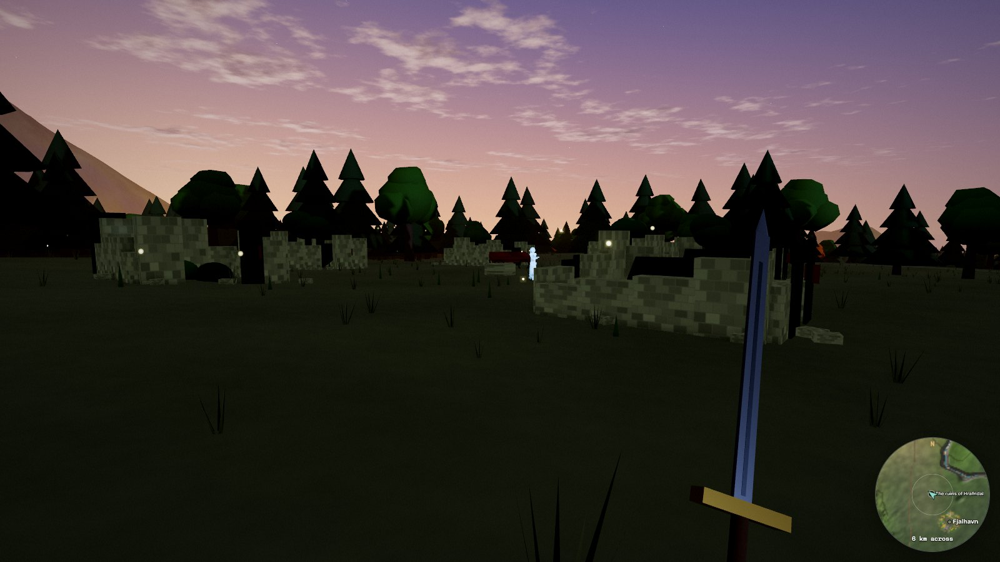

### ⚔️ Combat, hunting, fishing and reputation
- First-person sword combat with light and heavy (charged) attacks, blocking, and a timed parry.
- **A bow:** buy one from a hunter, draw and loose arrows that fly true under gravity, and pick them up again where they land. Fresh hoof and paw prints in the mud lead you to the game.
- **Fishing:** stand at the water and cast. Wait for the float to dip, strike, then reel without snapping the line. What bites depends on the water and the climate: herring and cod in cold seas, snapper and tuna in the tropics, trout, pike and salmon in the lakes. Sell your catch or cook it.
- Enemies use three attack styles (overhead, side cut, and thrust) along with shields, stagger, casting, and death animations.
- Enemies drop loot pouches you can pick up. Weapons improve from a traveller's sword up to a ranger's blade.
- **Every town remembers you.** Good deeds raise your standing from Neutral through Liked and Honoured to Hero, which brings gifts and warm greetings. Attack someone and bystanders flee, guards hunt you, and you're wanted with a bounty until you pay it off.

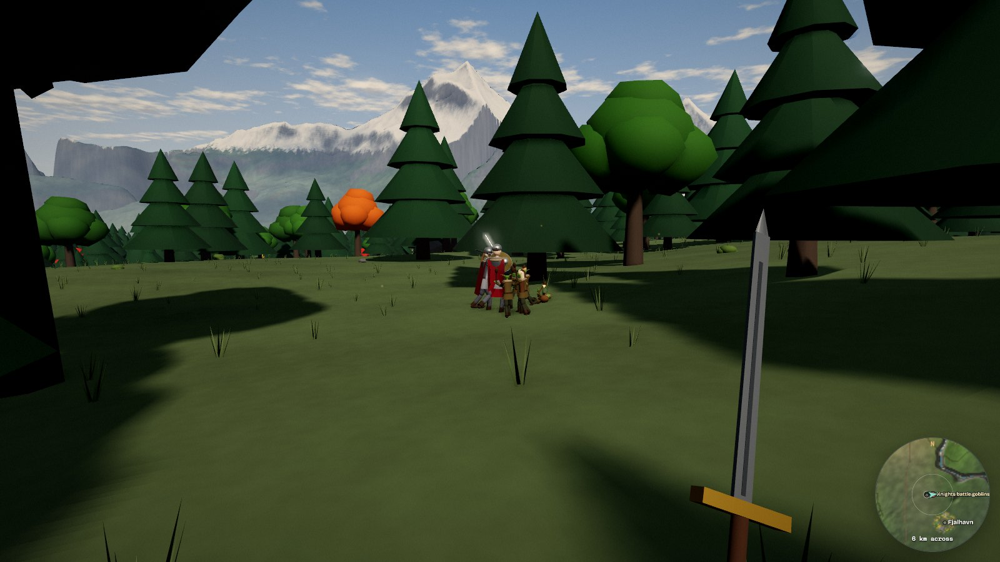

### 🗣️ Villagers who talk back, running locally and free
- Characters speak through **Llama 3.2 1B** running in your browser via [WebLLM](https://github.com/mlc-ai/web-llm). Each one gets a persona built from their job, quirks, relationships, town, and the time of day.
- Their lines are voiced by **[Kokoro 82M](https://github.com/hexgrad/kokoro)** on WebGPU. Voices are matched to each character's culture, gender, and age: children sound young, elders slower, and giants deep.
- Nothing leaves your computer. The models download once from the web and are cached by your browser. With them turned off, over 100 handwritten lines per role keep the world chatty.

### 🎵 A generative score
- An orchestra synthesized with Web Audio, with around 18 pieces chosen by mood and region:
  - Highland horns and harp pastorales in the temperate lands;
  - oud and frame drum in the desert, drones and choir in the frozen north;
  - marimba on tropical coasts, fiddle jigs in town, and a music box at night;
  - taiko drums that cut in the moment a fight starts.
- A soundscape of footsteps that change with the ground underfoot, owls, wolves, frogs, cicadas, gulls, roosters, town chatter, and crackling fires.

### 🧭 A map that helps you explore
- A survey map with contour lines. Discovered towns, peaks, caves, and places appear on it, and rumoured places show near towns you've visited.
- Every active quest has a marked destination, and live events show where they're happening.
- You can drop your own markers (cave, mine, camp, treasure, danger, landmark), then track one on the compass or fly to it.
- Roads and tracks are drawn on the minimap and the map. Places villagers tell you about, in their own words or when you ask for news, go straight onto your map.
- **A town directory.** Scroll to zoom right in (down to 400 m across) and drag to pan: every building of a town you know is drawn, with an icon on the ones worth finding: casinos, museums, inns and eating houses, shops and smiths, temples, healers and baths, the castle, fountains and wells. Filter by kind, search by name or trade ("casino", "smith", "tavern"), and for each place choose **Show** to zoom to it, **Go** to arrive at its door, or **Mark** to pin it. Clicking an icon on the map takes you to that door.

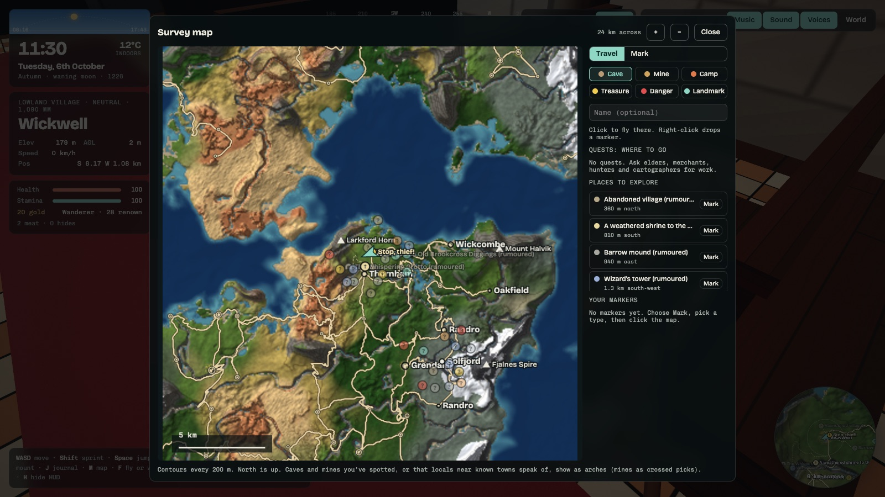

---

## Controls

| | |
|---|---|
| **WASD** | Move |
| **Shift** | Sprint |
| **Space** | Jump |
| **Mouse** | Look (click the view to capture the mouse) |
| **Left click** | Attack (hold for a heavy attack) |
| **Right click** | Block (well-timed to parry) |
| **E** | Talk, open doors, loot, interact |
| **R** | Eat or drink a healing draught |
| **B** | Switch between sword and bow |
| **E** at the water | Cast a line; E to strike, hold E to reel |
| **E** in the river at the gold workings | Pan for gold (buy a pan from a prospector) |
| **V** | Mount or dismount your horse |
| **J** | Journal (quests, atlas, bestiary, people) |
| **M** | Map |
| **F** | Toggle walking and flying |
| **G** | Glide |
| **[ ]** | Change the time of day |
| **Shift + [ ]** | Change the day |
| **H** | Hide the HUD |

---

## Running it locally

It's a single HTML file with no build step. Serve the folder with any static web server:

```bash
git clone https://github.com/kuczmama/meridian.git
cd meridian
python3 -m http.server 8000
# open http://localhost:8000
```

Opening `index.html` directly from disk won't work, because the terrain workers and modules need to be served over HTTP.

**Browser:** you need a recent Chrome, Edge, Brave, or Arc on desktop. Talking villagers and neural voices need **WebGPU**; without it the game still runs, using the handwritten lines and your system's voices. If Brave shows only the intro screen, click the lion icon (Shields) and allow scripts for the site.

**First launch with AI:** after you begin your journey, the language model (~0.8 GB) and voice model (~330 MB) download in the background and are cached for next time. The game is fully playable while they load. You can switch either of them off in **World → settings**.

---

## How it's built

- **Rendering:** [three.js](https://threejs.org/) r160, bundled locally in `vendor/`, with custom patched materials for terrain, foliage, and buildings. Buildings are drawn procedurally in a shader (windows, timber framing, stained glass), and post-processing adds bloom and GTAO.
- **World generation:** a pure, seeded `WorldGen` handles noise, climate, rivers, settlements, and A*-routed roads. It runs on a pool of Web Workers built from blob URLs, with a main-thread fallback.
- **People:** jointed, vertex-coloured figures merged per bone for speed, with procedural animation covering walking, work, sitting, praying, dancing, and a full set of combat poses.
- **AI:** WebLLM runs in its own worker so it never blocks the game. Kokoro TTS output is streamed clause by clause, so voices start quickly.
- **People:** near you, townsfolk are real bodies generated with [MakeHuman](http://www.makehumancommunity.org/) and dressed in medieval clothes tailored to each body, moved by motion capture from the [CMU Graphics Lab Motion Capture Database](http://mocap.cs.cmu.edu/) (walking, running, idling, talking, sitting, kneeling, sweeping and dancing), with every other action carried over from the jointed figures, which still fill the distance.
- **Interiors:** homes are planned by splitting the house into rooms around its stair and front door, then furnished against the walls by household. Furniture and props are photo-scanned glTF models (meshopt-compressed, decimated by size), surfaces are PBR texture sets, and the inside faces of the building shader are painted room by room from an atlas of wall finishes, which also keeps windows off walls hidden behind wardrobes and pictures.
- **Everything else is procedural:** the world, buildings and animals are generated in code, with canvas textures.

```
index.html          the whole game
people/             townsfolk bodies (glTF, meshopt-compressed), shared motion clips and their textures
interiors/          furniture and props (glTF), surface textures (WebP) and paintings for the insides of buildings
vendor/three/       three.js, its glTF loader and the post-processing passes it uses
docs/screenshots/   images for this README
```

### Credits

- Human bodies, skins, eyes, eyebrows, eyelashes and hair: [MakeHuman](http://www.makehumancommunity.org/) core assets, released under [CC0](https://creativecommons.org/publicdomain/zero/1.0/). Bodies were generated and rigged with MPFB; the clothes are made for this game.
- Motion capture: the [CMU Graphics Lab Motion Capture Database](http://mocap.cs.cmu.edu/), in Bruce Hahne's BVH conversion. The database was created with funding from NSF EIA-0196217, and its data may be freely used, modified and redistributed.
- Furniture, props and surface textures: [Poly Haven](https://polyhaven.com/), released under [CC0](https://creativecommons.org/publicdomain/zero/1.0/).
- Paintings and hanging scrolls: public-domain works from [The Metropolitan Museum of Art Open Access](https://www.metmuseum.org/about-the-met/policies-and-documents/open-access) collection (CC0).
- [three.js](https://threejs.org/) (MIT) and [meshoptimizer](https://github.com/zeux/meshoptimizer)'s decoder (MIT).

---

## Roadmap

Still to come:
- walkable castle walls and climbable towers;
- caves you walk into seamlessly, with no loading screen;
- new weapon types, and arrows that can fell bandits as well as game;
- supply chains the townsfolk run themselves (fields to mill to bakery to market), with prices that rise and fall.

---

<div align="center">

Made with a lot of noise functions. ✦ Seed 7741 is a good place to start.

</div>
